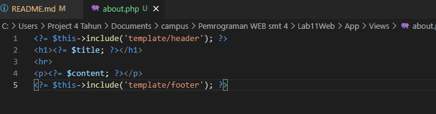

# Lab11Web

# Tugas Praktikum 11
Lengkapi kode program untuk menu lainnya yang ada pada Controller Page, sehingga 
semua link pada navigasi header dapat menampilkan tampilan dengan layout yang 
sama  

1. Menambah route untuk menu home

2. Menambahkan function pada file page.php

3. Menambahkan file home.php pada direktori view

4. Menambahkan file artikel.php pada direktori view

5. Menambahkan file contact.php pada direktori view

6. Hasil menu home

7. Hasil menu artikel

8. Hasil menu about

9. Hasil menu kontak

# Praktikum 11
1. Installasi & konfigurasi CodeIgneter

2. Membuat route baru pada file Routes.php

Hasil masih error sbb :

3. Membuat Controller (page.php)

Hasil :

4. Auto Routing

Hasil :

5. Membuat View

a. Membuat file about.php

b. Mengubah method about pada class Controller Page

c. Hasil

6. Membuat Layout Web dengan CSS

a. Membuat file header.php

b. Membuat file footer.php

c. mengubah file app/view/about.php

d. Hasil:

                         
